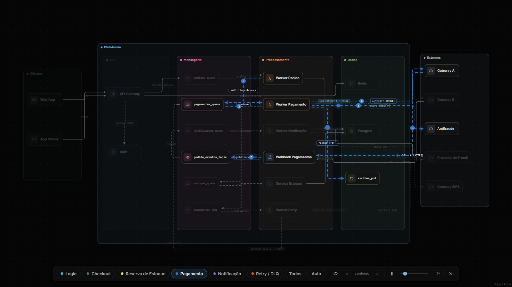
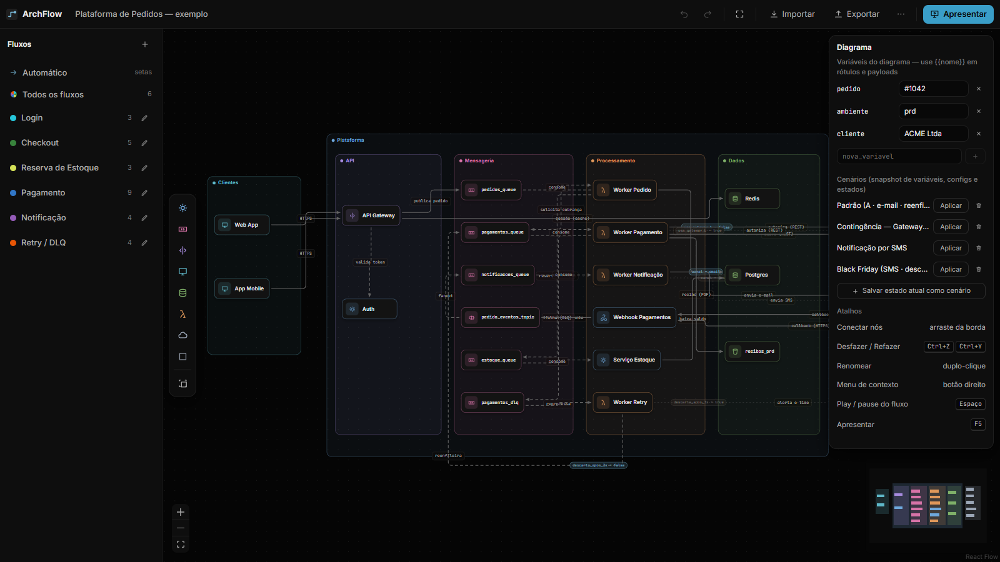
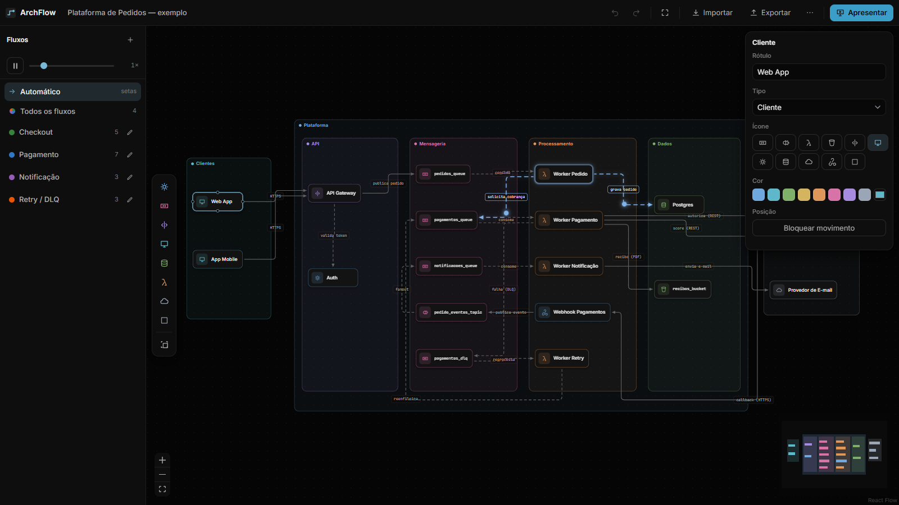

# ArchFlow

Visualizador de arquitetura **bonito e apresentável**: editor de diagramas com raias, roteamento
manual de arestas ortogonais (waypoints arrastáveis, estilo draw.io) e **fluxos animados** —
pacotes percorrendo o caminho exato desenhado, hop a hop, com o resto do diagrama esmaecido
(estilo Syncitect). Local-first: tudo roda no navegador, persistência em YAML + localStorage.


<sup>Modo apresentação: o fluxo Pagamento animado hop a hop, o resto do diagrama esmaecido.</sup>

## Rodando

```bash
npm install
npm run dev     # http://localhost:5183
```

Na primeira abertura carrega o diagrama de exemplo — **Plataforma de Pedidos**, uma arquitetura
fictícia de checkout (clientes → API → filas → workers → serviços externos) que exercita todos os
recursos da ferramenta. Para voltar a ele depois de editar: menu ⋯ → "Recarregar diagrama de
exemplo".

## Uso essencial

- **Editar**: arraste nós; conecte arrastando da borda de um nó; painel direito edita o item
  selecionado. Duplo-clique renomeia. Botão direito abre o menu de contexto (bloquear, trazer
  para frente/enviar para trás, excluir). `Ctrl+Z`/`Ctrl+Y` desfaz/refaz; `Ctrl+L` bloqueia;
  `Delete` exclui; setas movem (Shift = 1px). Ao arrastar um nó, a raia que vai recebê-lo acende.
- **Dobrar linhas** (estilo draw.io): selecione uma aresta e arraste um segmento — a dobra vira
  waypoint persistente. Duplo-clique na linha adiciona dobra; nos quadrados, remove. Arrastar a
  linha de volta à rota natural limpa as dobras sozinho; botão direito → "Limpar dobras" também.
  O rótulo da aresta é arrastável ao longo da linha.
- **Fluxos**: painel esquerdo. Selecionar um fluxo anima só o caminho dele, na ordem dos hops,
  com highlight nos nós à passagem do pacote. "Todos os fluxos" anima tudo; **"Automático"** é
  interativo: **clique num nó para disparar um evento**, que cascateia seguindo as setas a
  partir dali (ramificações incluídas) — sem configurar nada; vários eventos podem correr ao
  mesmo tempo. Velocidade 0.5×–4×, `Espaço` pausa. Para criar fluxos: `+` → "Adicionar hops"
  (clique nas arestas) ou "Seguir setas" para autocompletar o caminho. Hops reordenam por arrasto.
- **Apresentar** (`F5` ou `Ctrl+.`): tela cheia, só canvas + seletor de fluxos. Teclas `1–9`
  trocam de fluxo, `0` = todos, `A` = automático; `←`/`→` navegam hop a hop (modo passo a
  passo). `Esc` sai. `Shift+1` enquadra o diagrama.
- **Arquivos**: Exportar → YAML (versionável em git), SVG animado (fontes embutidas; visão atual
  ou todos os fluxos) ou PNG 2×. Importar aceita o mesmo YAML. Menu ⋯ guarda um histórico local
  de versões para restaurar.

## O diagrama de exemplo



**Plataforma de Pedidos** é uma arquitetura fictícia, feita só para exercitar a ferramenta: dois
clientes entram por um API Gateway, os pedidos viram mensagens em filas, workers processam,
pagamentos vão a serviços externos e o que falha cai numa DLQ com reprocessamento. São 19 nós em
7 raias aninhadas, 19 arestas (algumas com dobras manuais) e 4 fluxos prontos — Checkout,
Pagamento, Notificação e Retry/DLQ.

Como as setas seguem o sentido do dado, ele também é uma boa demonstração do **modo Automático**:
clique no `Web App` e o evento cascateia por onze ondas até chegar no provedor de e-mail.



> Seus diagramas reais não precisam (e não devem) morar aqui: mantenha-os fora do repositório e
> abra pelo botão **Importar**. A pasta `private/` já vem no `.gitignore` para isso.

## Documentação

- `CLAUDE.md` — arquitetura do código e decisões técnicas
- `docs/2026-08-06-melhorias-encontradas.md` — backlog de melhorias mapeado em teste real
- `docs/2026-08-07-proposta-configuracao-de-envio.md` — proposta: variáveis, arestas condicionais e inspetor de pacote
- `PRODUCT.md` / `DESIGN.md` — contexto de produto e sistema visual
